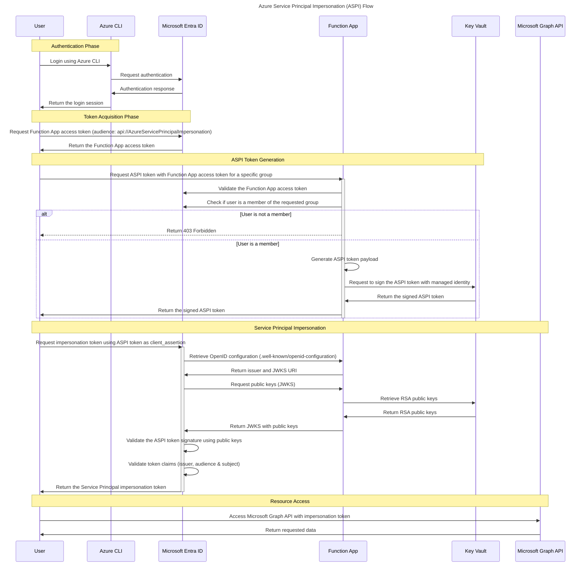

# 🔐 Azure Service Principal Impersonation

[](https://github.com/co-native-ab/azure-service-principal-impersonation/blob/main/LICENSE)
[](https://azure.microsoft.com)
[](https://www.terraform.io/)

A prototype for implementing Azure Service Principal Impersonation using Azure Functions and Key Vault. This project demonstrates an approach to temporary privilege elevation in complex Azure environments.

> **⚠️ PROTOTYPE:** This is a demonstration project and not intended for production use without additional security reviews.

## 🌟 Key Features

- **Group-based Access Control**: Impersonate only service principals you have access to
- **Secure Token Handling**: Leverages Azure Key Vault for secure key operations
- **Audit Trail Ready**: Designed with security monitoring in mind
- **Infrastructure as Code**: Complete Terraform setup for reproducibility

## 🔄 How It Works

The following sequence diagram illustrates the Azure Service Principal Impersonation process:



## 📋 Prerequisites

Before you begin, ensure you have the following tools installed:

- [Azure CLI](https://docs.microsoft.com/en-us/cli/azure/install-azure-cli) - For Azure resource management
- [Terraform](https://learn.hashicorp.com/tutorials/terraform/install-cli) - For infrastructure provisioning
- [jq](https://stedolan.github.io/jq/download/) - For JSON parsing
- [Azure Functions Core Tools](https://docs.microsoft.com/en-us/azure/azure-functions/functions-run-local) - For Function App development

All commands in this guide are intended for Unix-like environments. If you're using Windows, consider using [Windows Subsystem for Linux](https://docs.microsoft.com/en-us/windows/wsl/install).

## 🚀 Quick Start

### 1. Prepare Your Environment

Create configuration variables:

```shell
mkdir -p .tmp/
cat <<EOF > .tmp/lab.tfvars
common_name    = "aspi"
environment    = "lab"
location       = "Sweden Central"
location_short = "sc"
EOF
```

### 2. Deploy Infrastructure

```shell
terraform -chdir=terraform/ init
terraform -chdir=terraform/ apply -var-file=../.tmp/lab.tfvars
```

### 3. Deploy Function App

```shell
TF_OUTPUT=$(terraform -chdir=terraform/ output -json configuration)
FUNCTION_APP_NAME=$(jq -r .function_app_name <<< $TF_OUTPUT)
env --chdir=src/ func azure functionapp publish ${FUNCTION_APP_NAME}
```

## 🧪 Testing

### Test with Group Membership

Run the following script to test impersonation when your user has appropriate group membership:

```shell
TF_OUTPUT=$(terraform -chdir=terraform/ output -json configuration)
TENANT_ID=$(jq -r .tenant_id <<< $TF_OUTPUT)
TEST_CASES=( "demo_direct_membership" "demo_with_nested_group" "demo_user_assigned_managed_identity" )
FUNCTION_APP_URL=$(jq -r .function_app_url <<< $TF_OUTPUT)

for TEST_CASE in "${TEST_CASES[@]}"; do
  GROUP_OBJECT_ID=$(jq -r .groups.${TEST_CASE} <<< $TF_OUTPUT)
  TOKEN=$(az account get-access-token --resource api://AzureServicePrincipalImpersonation | jq -r .accessToken)
  ASPI_TOKEN=$(curl --fail -s -H "Authorization: Bearer ${TOKEN}" "https://${FUNCTION_APP_URL}/token?group_object_id=${GROUP_OBJECT_ID}" | jq -r .access_token)
  APPLICATION_ID_OF_SERVICE_PRINCIPAL_TO_IMPERSONATE=$(jq -r .applications.${TEST_CASE} <<< $TF_OUTPUT)
  IMPERSONATION_TOKEN=$(curl --fail -s -X POST "https://login.microsoftonline.com/${TENANT_ID}/oauth2/v2.0/token" \
    -H 'Content-Type: application/x-www-form-urlencoded' \
    --data-urlencode 'grant_type=client_credentials' \
    --data-urlencode "client_id=${APPLICATION_ID_OF_SERVICE_PRINCIPAL_TO_IMPERSONATE}" \
    --data-urlencode 'client_assertion_type=urn:ietf:params:oauth:client-assertion-type:jwt-bearer' \
    --data-urlencode 'scope=https://graph.microsoft.com/.default' \
    --data-urlencode "client_assertion=${ASPI_TOKEN}" \
    | jq -r .access_token)
  APP_NAME=$(curl --fail -s -H "Authorization: Bearer ${IMPERSONATION_TOKEN}" "https://graph.microsoft.com/v1.0/servicePrincipals(appId='${APPLICATION_ID_OF_SERVICE_PRINCIPAL_TO_IMPERSONATE}')" | jq -r .displayName)
  echo "${TEST_CASE}: ${APP_NAME}"
done
```

Expected output:

```
demo_direct_membership: aspi-demo-direct-membership
demo_with_nested_group: aspi-demo-with-nested-group
demo_user_assigned_managed_identity: aspi-demo-user-assigned-managed-identity
```

### Test Without Membership

Test access denial when user lacks group membership:

```shell
TF_OUTPUT=$(terraform -chdir=terraform/ output -json configuration)
TENANT_ID=$(jq -r .tenant_id <<< $TF_OUTPUT)
GROUP_OBJECT_ID=$(jq -r .groups.demo_without_members <<< $TF_OUTPUT)
TOKEN=$(az account get-access-token --resource api://AzureServicePrincipalImpersonation | jq -r .accessToken)
curl -v -H "Authorization: Bearer ${TOKEN}" "https://${FUNCTION_APP_URL}/token?group_object_id=${GROUP_OBJECT_ID}"
```

## 🔍 Use Cases

- **DevOps Automation**: Securely automate tasks requiring different service principal permissions
- **Temporary Access**: Grant time-limited access to service principals
- **Cross-Team Collaboration**: Allow teams to use service principals without sharing credentials

## ⭐ Support This Project

If you find this project useful, please consider giving it a star on GitHub! It helps others discover the project and encourages continued development.

[](https://github.com/co-native-ab/azure-service-principal-impersonation)

## 📜 License

This project is licensed under the [MIT License](LICENSE).
